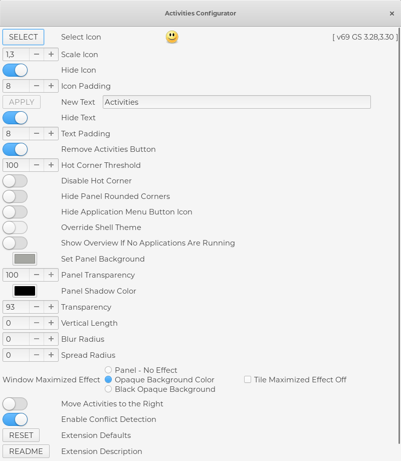

# A guide for installing and setting up a DISTRO on a USB

#### this guide applies to any distro, especially GNOME based, but it's written for Fedora. Instructions may vary slightly.

## Requirements
You will need **two** USBs. One USB you have to make into a live-cd as you normally do when installing a distro. The second USB is the target media and will be where you install Fedora. 

## Installing
Boot your PC with **only** your bootable USB plugged in and launch into a live environment. You should see a dialogue window asking if you want to try or install to hard drive. At this point you plug in your second USB and choose install to hard drive. 

#### Important 
When choosing what drive to install to, choose your USB and make sure you use **customized** partitioning. 

1. Make a 500 MB /boot/efi partition
2. Make a 4 000 MB swap partition
3. Make a 16 000 MB /home partition
4. The rest can go to the root / partition

## Post installation
These instructions are for customizing your setup, and adding some quality of life tools.

### Highly recommended
- Install **GNOME-TWEAKS** to unlock all gnome customizations
- Install the **zsh** shell with the **oh-my-zsh** plugin, with the **custom theme** "gitster"
- - This require a "powerline font" and some configuration. 
- Disable **Search** in the "Setttings menu" to increase performance. This will stop the indexing of files, but you can still search for installed apps as usual.
- In GNOME-TWEAKS > Window Titlebars > enable **Minimize** button. Maximize is personal preference.

### Eye candy
Install the following GNOME EXTENSIONS:


Configure **Activities configurator** to change the topbar look and feel. 

- **Arc menu** to replace the default top left menu (windows key still open old one)
- In GNOME-TWEAKS > Top Bar > diable App menu and enable Date / weekday

Install **Plank**, an iOS style app dock launcher, and add it to your startup applications in GNOME-TWEAKS. 

Install the Elementary GTK theme and the Elementary Plank theme:
```bash
sudo dnf install elementary-theme
sudo dnf install elementary-theme-plank
```
And change theme in GNOME-TWEAKS > Appearance > Applications. Plank theme can be configured by holding Ctrl + right click on the dock.
